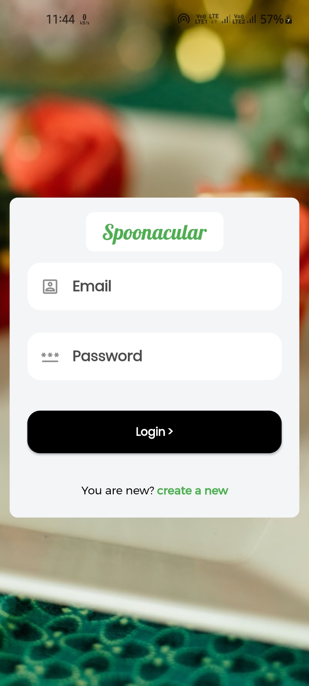
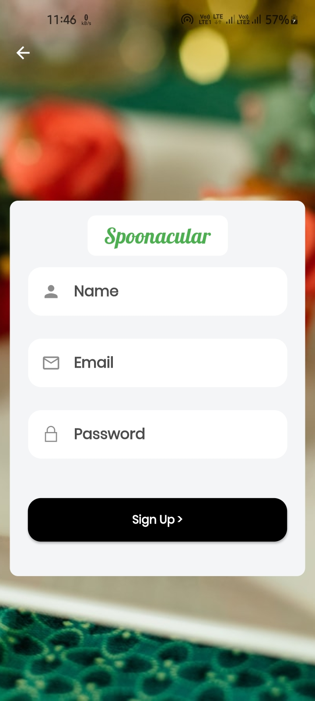
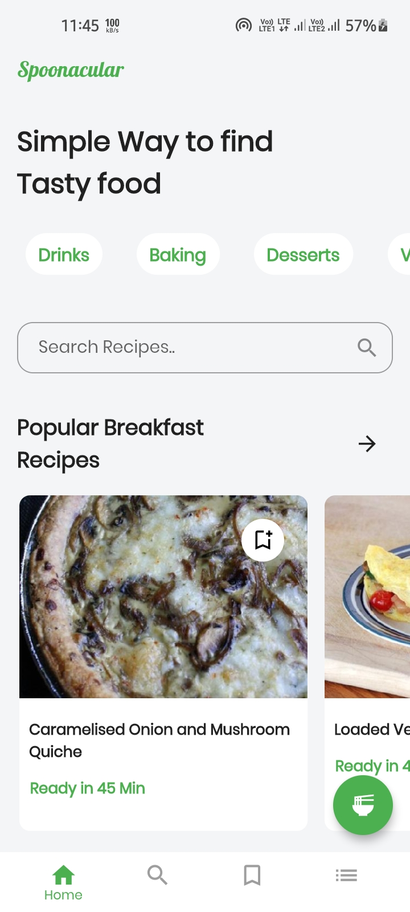
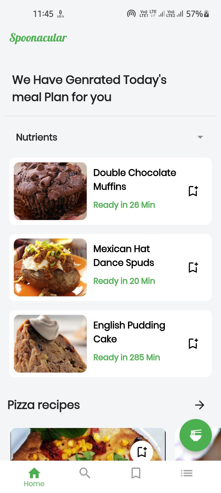
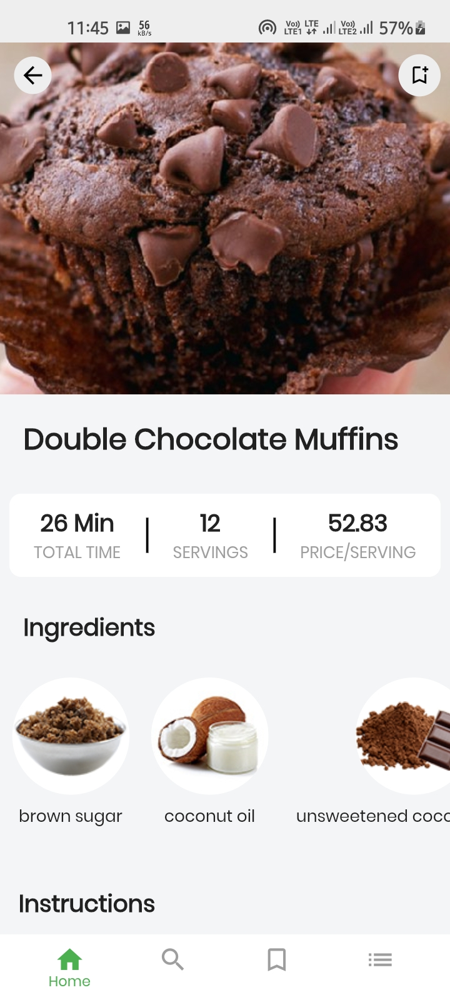
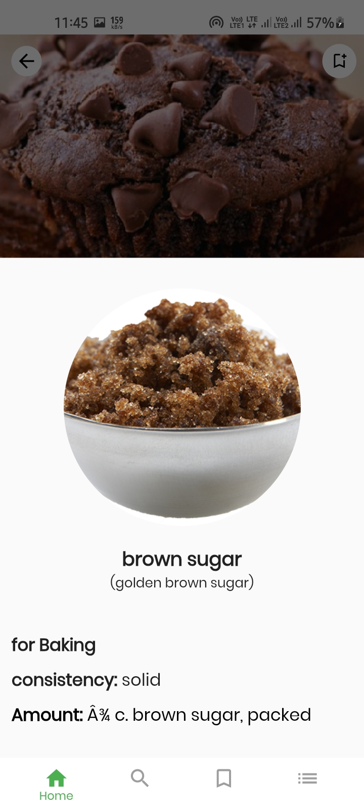
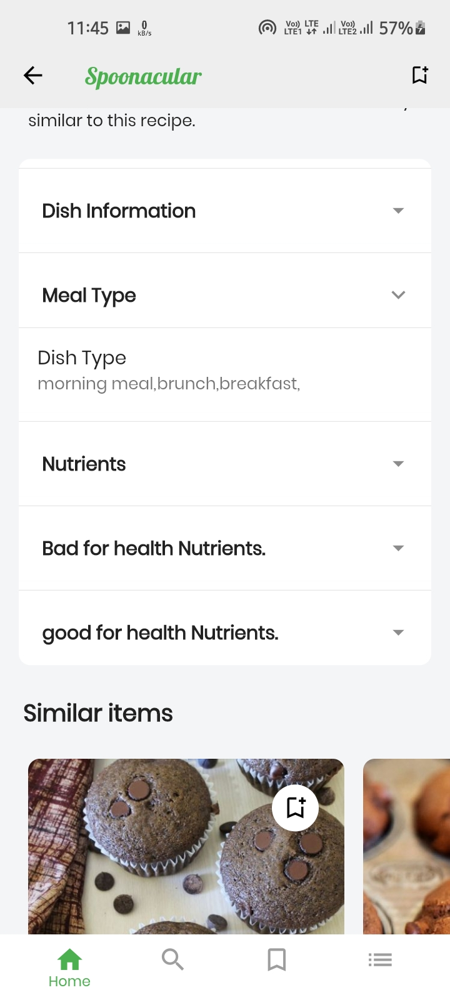
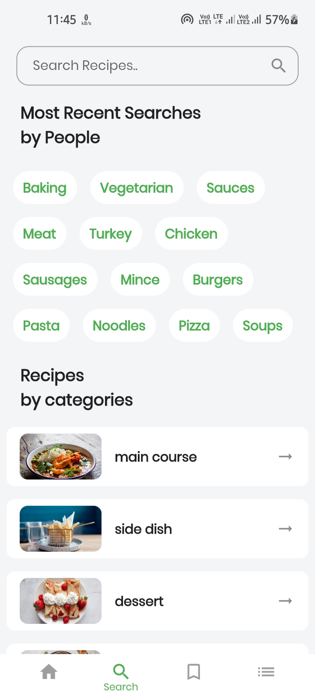
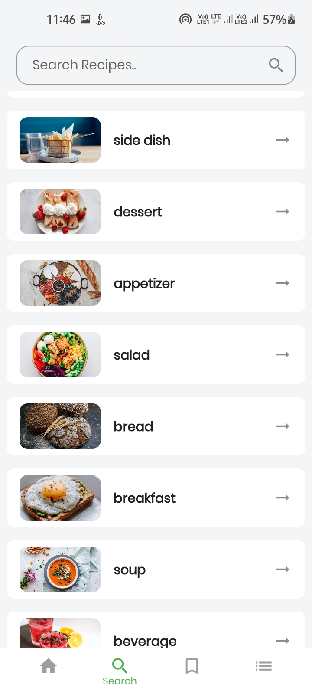

# Flutter-Bloc-Recipe-app


## App Features.

- App includes 5,0000+ recipes.
- cost breakdown per servings.
- related Recipes.
- Auto Complete search Feature.
- Save recipes for letter.
- get random recipes.
- Everyday's meal plan with nutritions.

## App Information

Here,i created this app with [Spoonacular open source food api](https://spoonacular.com/food-api/) and firebase to save recipes. In starting of the app add Auth screen and for keep user login i used shared_preferences plugin.

**Packages used:**

- cached_network_image: ^3.0.0
- cloud_firestore: ^2.2.0
- equatable: ^2.0.2
- expandable: ^5.0.1
- firebase_auth: ^1.2.0
- firebase_core: ^1.2.0
- firebase_messaging: ^10.0.1
- flutter_bloc: ^7.0.0
- flutter_html: ^2.0.0
- flutter_markdown: ^0.6.2
- flutter_phoenix: ^1.0.0
- flutter_spinkit: ^5.0.0
- google_fonts: ^2.1.0
- http: ^0.13.3
- line_icons: ^2.0.1
- persistent_bottom_nav_bar: ^4.0.2
- photo_view: ^0.11.1
- shared_preferences: ^2.0.6
- url_launcher: ^6.0.4

<p align="center">










</p>

## How to use

To clone and run this application, you'll need [Git](https://git-scm.com/downloads) and [Flutter](https://flutter.dev/docs/get-started/install) installed on your computer. From your command line:

```
# Clone this repository
$ git clone https://github.com/Ansh-Rathod/Flutter-Bloc-Recipe-app.git

# Go into the repository
$ cd Flutter-Bloc-Recipe-App

# Install dependencies
$ flutter packages get

# Run the app
$ flutter run
```

