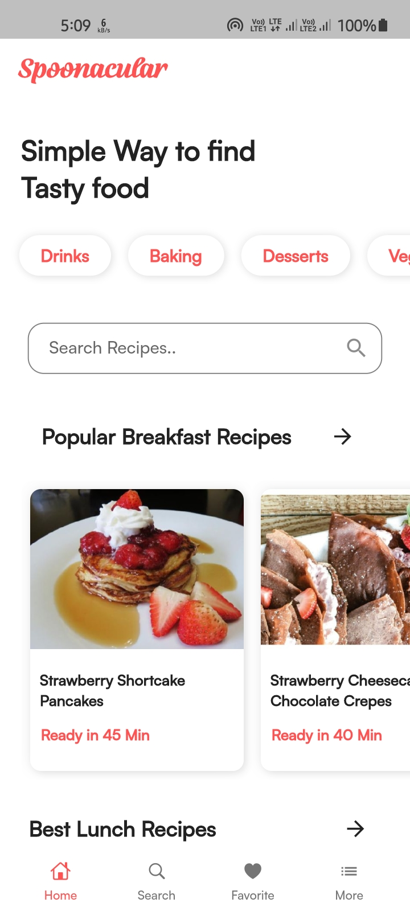
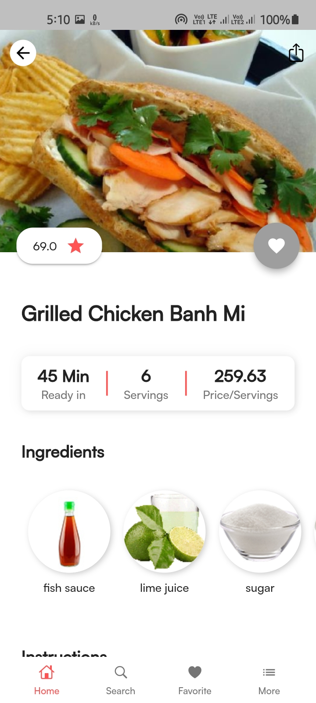
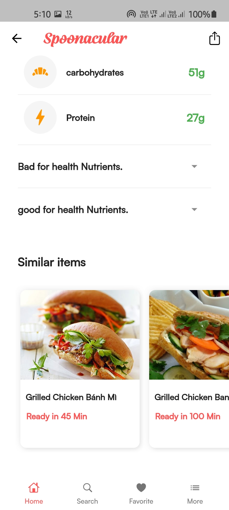
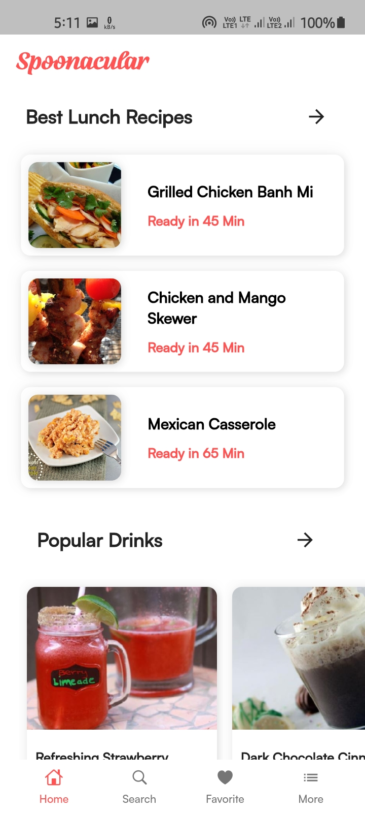
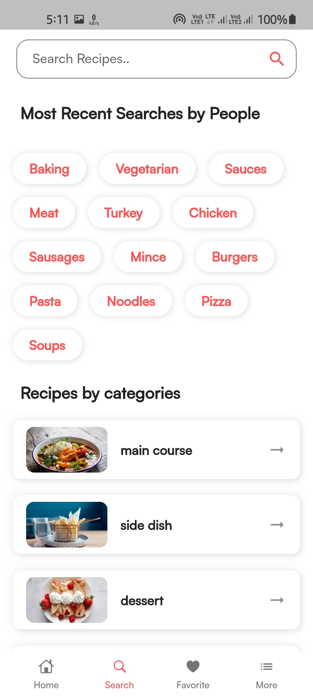
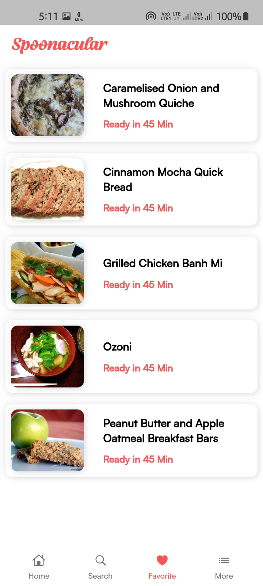
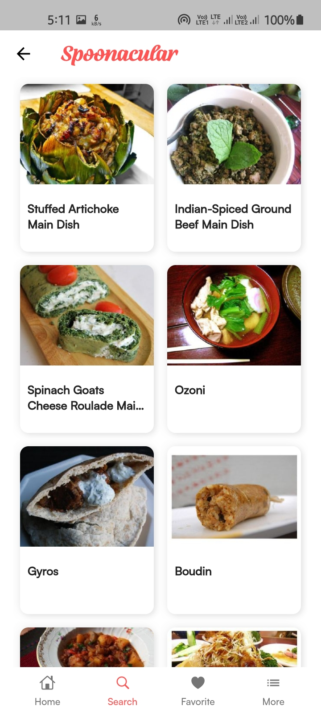
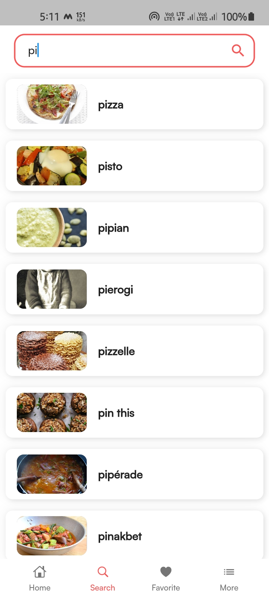

# Flutter-Bloc-Recipe-app

## App Features.

- App includes 5,0000+ recipes.
- cost breakdown per servings.
- related Recipes.
- Auto Complete search Feature.
- Save recipes for letter.
- get random recipes.
- Everyday's meal plan with nutritions.

## Changelog

- New UI design added.
- Added Animation.
- app integrated with deep links.
- removed useless login/signUp.
- Added local database.

**note:- This is latest version(v1.0.1) of app. you can go to lower version(1.0.0) by changing branch to main**.

## App Information

Here,i created this app with [Spoonacular open source food api](https://spoonacular.com/food-api/) and firebase to save recipes. In starting of the app add Auth screen and for keep user login i used shared_preferences plugin.

**Packages used:**

- bottom_nav_bar:
- git:
- url: https://github.com/Ansh-Rathod/bottom_nav_bar
- cached_network_image: ^3.1.0
- cupertino_icons: ^1.0.2
- dio: ^4.0.0
- dio_log: ^2.0.0
- equatable: ^2.0.3
- firebase_dynamic_links: ^2.0.10
- flutter_bloc: ^7.3.0
- flutter_html: ^2.1.5
- hive_flutter: ^1.1.0
- path_provider: ^2.0.5
- share: ^2.0.4
- url_launcher: ^6.0.12

<p align="center">










</p>

## How to use

To clone and run this application, you'll need [Git](https://git-scm.com/downloads) and [Flutter](https://flutter.dev/docs/get-started/install) installed on your computer. From your command line:

```
# Clone this repository
$ git clone https://github.com/Ansh-Rathod/Flutter-Bloc-Recipe-app.git

# Go into the repository
$ cd Flutter-Bloc-Recipe-App

# Install dependencies
$ flutter packages get

# Run the app
$ flutter run
```

